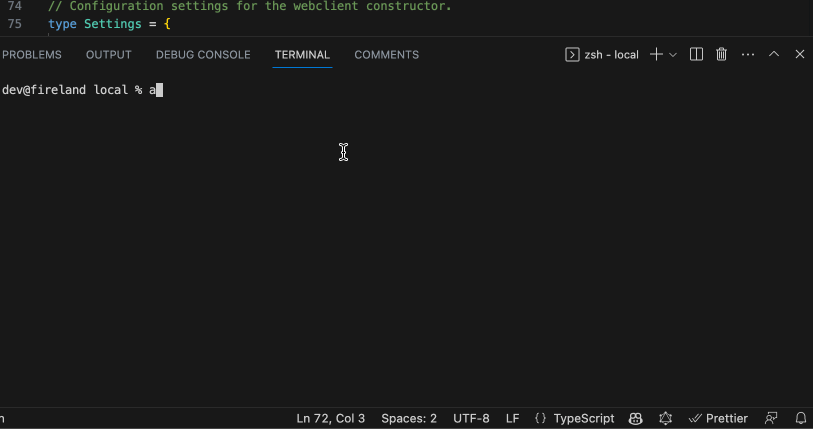

# Console AI

Console-based tool to query OpenAI directly, streamlining AI-powered insights from your terminal.

## Demo

## Usage

- Type `ai` and and press <kbd>Enter</kbd>.
- `ai init` to (re)initialise Console AI.
- `ai help`
